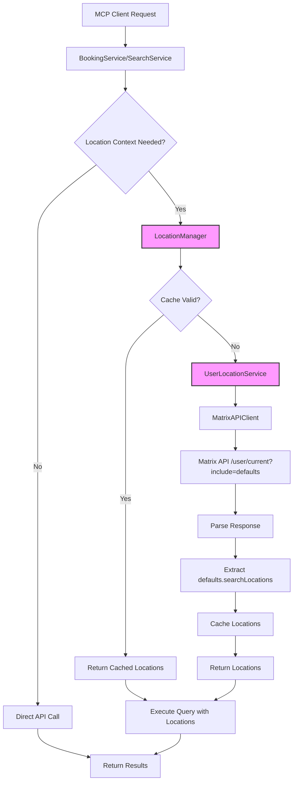
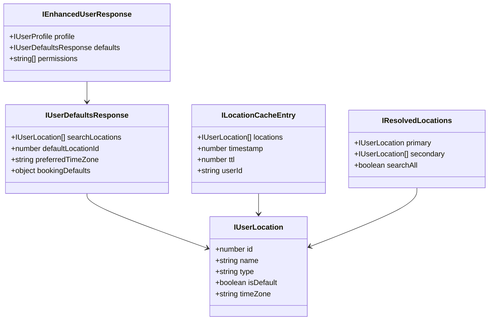
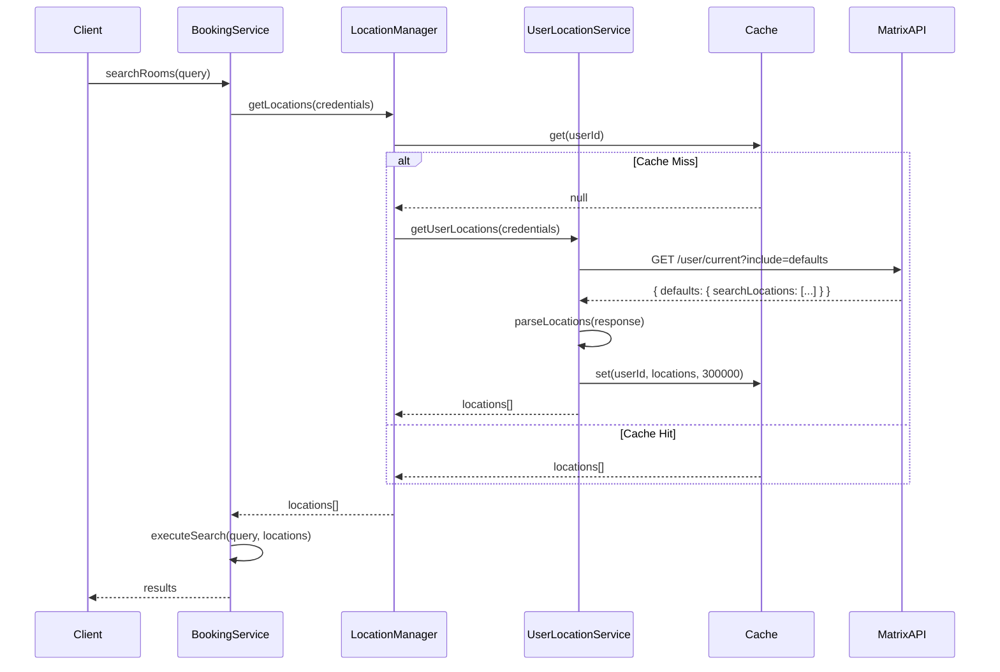
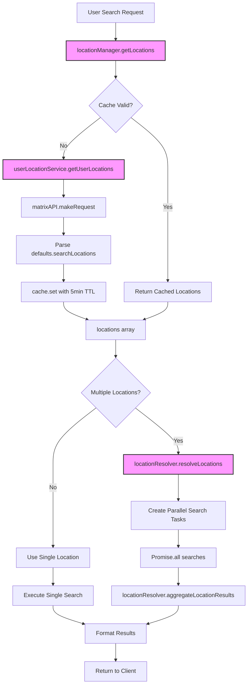
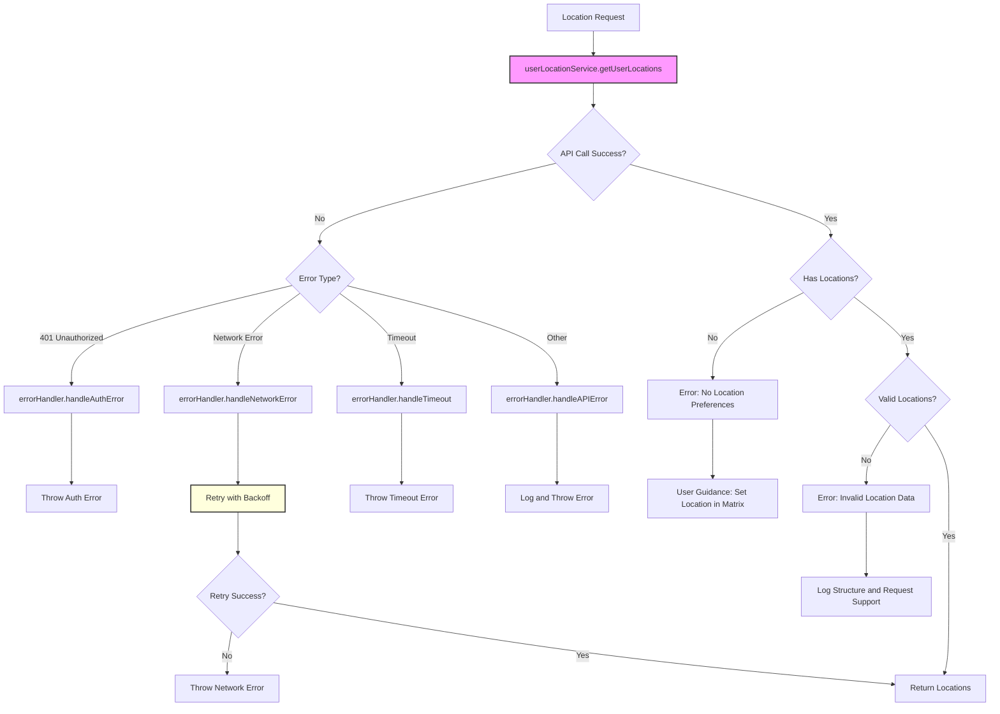
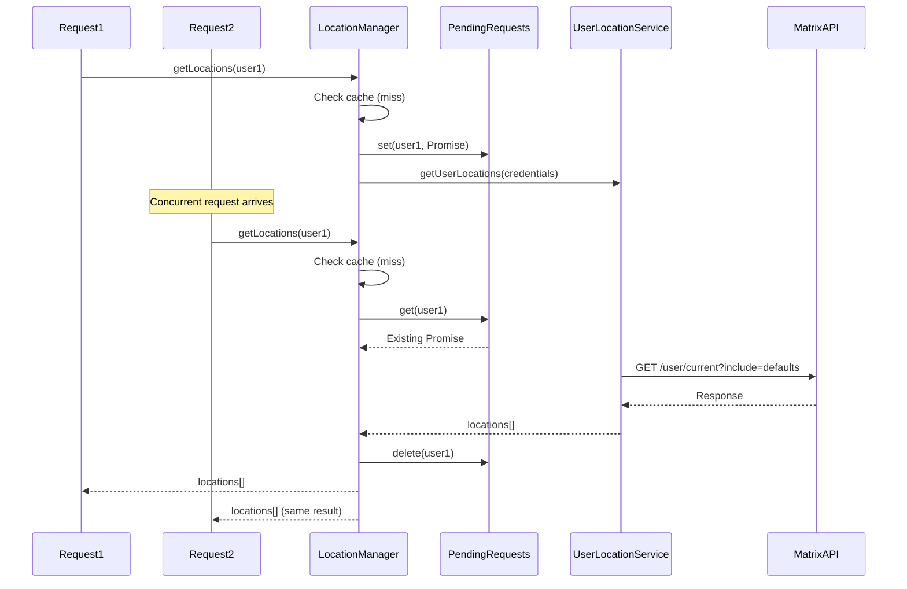

# Design Document - Dynamic User Location Feature

## Overview

The Dynamic User Location feature eliminates static environment variable dependencies by dynamically retrieving user location preferences from the Matrix Booking API. This design provides a flexible, user-centric approach to location management that automatically adapts to user profile changes and supports multi-location scenarios.

### Design Goals
- Eliminate `MATRIX_PREFERED_LOCATION` environment variable dependency
- Dynamically fetch user locations from `/api/v1/user/current?include=defaults` endpoint
- Support multiple simultaneous location searches
- Implement efficient session-based caching with 5-minute TTL
- Provide clear error handling for users without location preferences
- Maintain backward compatibility with existing booking operations

### Key Design Decisions
- **On-demand fetching**: Locations retrieved only when needed, not preloaded
- **Session-based caching**: 5-minute TTL balances performance with data freshness
- **Request deduplication**: Prevents duplicate API calls for concurrent requests
- **Multi-location support**: Searches across all user locations simultaneously
- **Error-first approach**: Clear user guidance when location data is unavailable

## Architecture Design

### System Architecture Diagram



### Data Flow Diagram

```mermaid
graph LR
    A[User Query] --> B[Parse Request]
    B --> C{Has Location?}
    C -->|No| D[Get User Locations]
    C -->|Yes| E[Validate Location]
    
    D --> F[Check Cache]
    F --> G{Cache Hit?}
    G -->|No| H[Fetch from API]
    G -->|Yes| I[Use Cached Data]
    
    H --> J[/api/v1/user/current?include=defaults]
    J --> K[Parse defaults.searchLocations]
    K --> L[Store in Cache]
    L --> M[Location Array]
    I --> M
    
    E --> N{Valid Location?}
    N -->|No| O[Error: Invalid Location]
    N -->|Yes| P[Single Location]
    
    M --> Q{Multiple Locations?}
    Q -->|Yes| R[Parallel Search]
    Q -->|No| S[Single Search]
    P --> S
    
    R --> T[Aggregate Results]
    S --> U[Return Results]
    T --> U
    O --> V[Return Error]
```

## Component Design

### UserLocationService
**Responsibilities:**
- Fetch user location preferences from Matrix API
- Parse and validate location data from API response
- Coordinate with cache manager for performance optimization
- Handle errors and provide fallback mechanisms

**Interfaces:**
```typescript
interface IUserLocationService {
  getUserLocations(credentials: ICredentials): Promise<IUserLocation[]>;
  validateUserLocation(locationId: number, credentials: ICredentials): Promise<boolean>;
  clearUserLocationCache(): void;
}
```

**Dependencies:**
- IMatrixAPIClient: For API communication
- ILocationCacheManager: For caching logic
- IErrorHandler: For consistent error handling
- IConfigurationManager: For configuration access

### LocationCacheManager
**Responsibilities:**
- Manage in-memory cache for user locations
- Implement TTL-based cache expiration (5 minutes)
- Handle concurrent request deduplication
- Provide cache statistics and monitoring

**Interfaces:**
```typescript
interface ILocationCacheManager {
  get(userId: string): IUserLocation[] | null;
  set(userId: string, locations: IUserLocation[], ttl?: number): void;
  invalidate(userId: string): void;
  clear(): void;
  getStats(): ICacheStatistics;
}
```

**Dependencies:**
- None (standalone component)

### LocationResolver
**Responsibilities:**
- Determine location context for queries
- Resolve location conflicts and priorities
- Support multi-location query execution
- Aggregate results from multiple locations

**Interfaces:**
```typescript
interface ILocationResolver {
  resolveLocations(request: ILocationRequest, userLocations: IUserLocation[]): IResolvedLocations;
  aggregateLocationResults(results: ILocationResult[]): IAggregatedResult;
  validateLocationAccess(locationId: number, userLocations: IUserLocation[]): boolean;
}
```

**Dependencies:**
- IUserLocationService: For location data
- ILocationCacheManager: For cached data access

## Data Model

### Core Data Structure Definitions

```typescript
// User location as returned from API
interface IUserLocation {
  id: number;
  name: string;
  type: 'Location' | 'Building' | 'Floor' | 'Area';
  isDefault?: boolean;
  timeZone?: string;
}

// Enhanced user response with defaults
interface IUserDefaultsResponse {
  searchLocations: IUserLocation[];
  defaultLocationId?: number;
  preferredTimeZone?: string;
  bookingDefaults?: {
    duration?: number;
    startTime?: string;
  };
}

// Full user response from /api/v1/user/current?include=defaults
interface IEnhancedUserResponse extends ICurrentUserResponse {
  defaults?: IUserDefaultsResponse;
}

// Cache entry structure
interface ILocationCacheEntry {
  locations: IUserLocation[];
  timestamp: number;
  ttl: number;
  userId: string;
}

// Location resolution result
interface IResolvedLocations {
  primary: IUserLocation;
  secondary: IUserLocation[];
  searchAll: boolean;
}

// Aggregated search result
interface IAggregatedResult {
  results: ILocationResult[];
  totalCount: number;
  locationBreakdown: Map<number, number>;
}
```

### Data Model Diagram



## Business Process

### Process 1: Initial Location Retrieval



### Process 2: Multi-Location Search



### Process 3: Error Handling Flow



### Process 4: Concurrent Request Deduplication



## Error Handling Strategy

### Error Categories and Responses

| Error Type | Condition | User Message | Action |
|------------|-----------|--------------|--------|
| No Location Preferences | `defaults.searchLocations` is empty or missing | "No location preferences found. Please set your preferred location in Matrix Booking settings." | Guide to Matrix settings |
| Authentication Failed | 401 response from API | "Authentication failed. Please check your Matrix Booking credentials." | Re-authenticate |
| Network Error | Connection timeout or failure | "Unable to connect to Matrix Booking. Please check your network connection." | Retry with exponential backoff |
| Invalid Location Data | Malformed API response | "Received invalid location data. Please contact support." | Log actual structure, fail gracefully |
| Location Not Authorized | User specifies unauthorized location | "You don't have access to location: {name}. Available locations: {list}" | List valid locations |
| API Rate Limited | 429 response | "Too many requests. Please wait a moment and try again." | Implement backoff |

### Error Recovery Mechanisms

```typescript
class LocationErrorRecovery {
  async handleLocationError(error: Error, context: IErrorContext): Promise<IRecoveryAction> {
    if (error.message.includes('No location preferences')) {
      return {
        action: 'PROMPT_USER',
        message: 'Please configure your location in Matrix Booking',
        link: 'https://app.matrixbooking.com/settings/preferences'
      };
    }
    
    if (error.message.includes('Network')) {
      return {
        action: 'RETRY',
        retryAfter: this.calculateBackoff(context.attemptNumber),
        maxRetries: 3
      };
    }
    
    if (error.message.includes('Invalid location data')) {
      // Log the actual response structure for debugging
      this.logger.error('Invalid location structure', {
        response: context.apiResponse,
        expected: 'defaults.searchLocations array'
      });
      
      return {
        action: 'FAIL',
        message: 'Location data format error. Support has been notified.',
        supportTicket: this.createSupportTicket(context)
      };
    }
    
    return {
      action: 'FAIL',
      message: error.message
    };
  }
}
```

## Testing Strategy

### Unit Testing
- Mock API responses with various location configurations
- Test cache TTL expiration and refresh logic
- Verify request deduplication behavior
- Test error handling for all failure scenarios
- Validate location resolution logic

### Integration Testing
- Test actual API endpoint with test credentials
- Verify response parsing with real data structures
- Test multi-location search aggregation
- Validate error messages and recovery flows
- Test performance under concurrent load

### Test Scenarios
1. **Single Location User**: Verify correct location extraction and usage
2. **Multi-Location User**: Test parallel search and result aggregation
3. **No Location User**: Verify error message and guidance
4. **Cache Expiration**: Test automatic refresh after 5 minutes
5. **Concurrent Requests**: Verify deduplication prevents multiple API calls
6. **Network Failures**: Test retry logic with exponential backoff
7. **Invalid API Response**: Verify graceful handling and logging
8. **Location Validation**: Test rejection of unauthorized locations

## Implementation Approach

### Phase 1: Core Infrastructure (Priority 1)
1. Create `IUserLocation` and `IEnhancedUserResponse` interfaces
2. Implement `UserLocationService` with API integration
3. Add response parsing for `defaults.searchLocations`
4. Implement basic error handling

### Phase 2: Caching Layer (Priority 2)
1. Implement `LocationCacheManager` with TTL support
2. Add request deduplication logic
3. Integrate cache with `UserLocationService`
4. Add cache statistics and monitoring

### Phase 3: Multi-Location Support (Priority 3)
1. Implement `LocationResolver` for location logic
2. Add parallel search execution
3. Implement result aggregation
4. Update existing services to use location context

### Phase 4: Enhanced Error Handling (Priority 4)
1. Implement comprehensive error recovery
2. Add user guidance messages
3. Implement retry with exponential backoff
4. Add detailed logging for debugging

### Phase 5: Testing and Documentation (Priority 5)
1. Write comprehensive unit tests
2. Add integration tests with real API
3. Update API documentation
4. Create migration guide for removal of environment variable

## Performance Considerations

### Optimization Strategies
- **Cache-first approach**: Always check cache before API calls
- **Request batching**: Deduplicate concurrent requests to same user
- **Parallel execution**: Search multiple locations simultaneously
- **Lazy loading**: Fetch locations only when needed
- **Circuit breaker**: Prevent cascading failures on API issues

### Performance Metrics
- Cache hit ratio target: >80% after warm-up
- API response time: <2 seconds (with 5-second timeout)
- Cache lookup time: <10ms
- Concurrent request handling: 100+ simultaneous requests
- Memory footprint: <50MB for 1000 cached users

## Security Considerations

### Data Protection
- No persistence of location data to disk
- Clear cache on session end
- Redact PII from error logs
- Use existing authentication mechanisms
- Validate all API responses before processing

### Access Control
- Verify user has access to requested locations
- Prevent location enumeration attacks
- Rate limit API requests per user
- Audit log location access patterns
- Implement proper error masking

## Migration Plan

### Backward Compatibility
- Keep `MATRIX_PREFERED_LOCATION` as fallback (deprecated)
- Log warnings when environment variable is used
- Provide clear migration timeline to users
- Document removal in changelog

### Migration Steps
1. Deploy feature with fallback to environment variable
2. Monitor adoption and log usage patterns
3. Notify users of deprecation timeline
4. Remove environment variable support in next major version
5. Clean up configuration documentation

## Success Metrics

### Technical Metrics
- Zero dependency on `MATRIX_PREFERED_LOCATION` variable
- <2 second location fetch time
- >99% cache availability
- <1% error rate for location retrieval
- 100% test coverage for new components

### User Experience Metrics
- Successful location resolution for 100% of users with preferences
- Clear error messages for users without locations
- Support for all multi-location use cases
- No degradation in booking query performance
- Reduced configuration complexity

## Risks and Mitigations

| Risk | Impact | Likelihood | Mitigation |
|------|--------|------------|------------|
| API endpoint changes | High | Low | Version detection, graceful fallback |
| Cache memory overflow | Medium | Low | Implement LRU eviction |
| Network instability | Medium | Medium | Retry logic, circuit breaker |
| Concurrent request storms | Low | Medium | Request deduplication |
| Invalid location data | High | Low | Comprehensive validation |

## Dependencies and Constraints

### Technical Dependencies
- Matrix Booking API `/api/v1/user/current?include=defaults` endpoint
- Existing authentication infrastructure
- Node.js memory for caching
- Network connectivity to Matrix API

### Constraints
- Must use existing authentication mechanism
- Cannot modify Matrix Booking API
- Must maintain backward compatibility initially
- Limited to session-based caching (no persistence)
- Must handle users with 0-50 locations efficiently

## Conclusion

This design provides a robust, scalable solution for dynamic user location management that eliminates static configuration dependencies while supporting complex multi-location scenarios. The implementation focuses on performance through intelligent caching, reliability through comprehensive error handling, and user experience through clear feedback mechanisms.