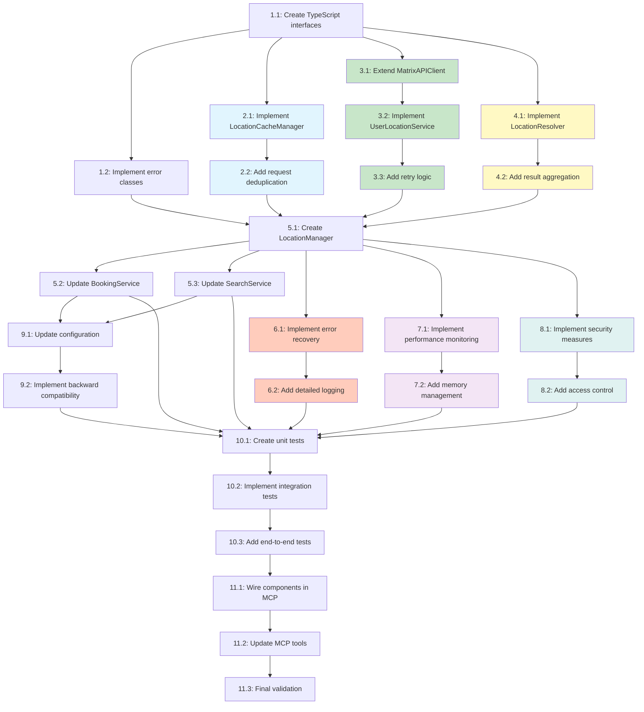

# Implementation Plan - Dynamic User Location Feature

## Overview
This implementation plan converts the dynamic user location design into a series of test-driven development tasks. Each task builds incrementally on previous work, ensuring no orphaned code and maintaining integration throughout the implementation process.

## Tasks

### 1. Core Infrastructure Setup

- [ ] 1.1 Create TypeScript interfaces and data models for user location
  - Create `src/types/location.ts` with IUserLocation, IUserDefaultsResponse, and IEnhancedUserResponse interfaces
  - Define ILocationCacheEntry and IResolvedLocations interfaces
  - Add type exports to main types index file
  - Write unit tests to validate interface structure and type safety
  - _Requirements: 1.1, 1.2, 1.3, 2.1_

- [ ] 1.2 Implement base error classes for location-specific errors
  - Create `src/errors/LocationError.ts` with custom error classes
  - Define NoLocationPreferencesError, InvalidLocationError, LocationNotAuthorizedError
  - Include error codes and user-friendly messages
  - Write unit tests for error instantiation and message formatting
  - _Requirements: 5.1, 5.2, 5.3, 5.4, 5.5_

### 2. Cache Implementation

- [ ] 2.1 Implement LocationCacheManager with TTL support
  - Create `src/services/LocationCacheManager.ts` with ILocationCacheManager interface
  - Implement get, set, invalidate, and clear methods
  - Add TTL-based expiration logic (5-minute default)
  - Implement cache statistics tracking (hits, misses, evictions)
  - Write unit tests for cache operations and TTL expiration
  - _Requirements: 1.5, 4.2, 4.3, 6.3_

- [ ] 2.2 Add request deduplication to cache manager
  - Implement pending requests Map to track in-flight API calls
  - Add logic to return existing Promise for concurrent requests to same user
  - Implement cleanup of pending requests after completion
  - Write unit tests for concurrent request scenarios
  - _Requirements: 4.4, 6.4_

### 3. API Integration Layer

- [ ] 3.1 Extend MatrixAPIClient to support user defaults endpoint
  - Add method `getCurrentUserWithDefaults()` to existing MatrixAPIClient
  - Implement query parameter handling for `?include=defaults`
  - Add response type validation for enhanced user response
  - Write unit tests with mocked API responses
  - _Requirements: 1.1, 3.1, 3.5_

- [ ] 3.2 Implement UserLocationService for location fetching
  - Create `src/services/UserLocationService.ts` implementing IUserLocationService
  - Implement getUserLocations method with API integration
  - Add response parsing for defaults.searchLocations array
  - Include error handling for missing or malformed location data
  - Write unit tests for various API response scenarios
  - _Requirements: 1.1, 1.2, 1.3, 5.2, 5.3_

- [ ] 3.3 Add retry logic with exponential backoff to UserLocationService
  - Implement retry mechanism for network failures (max 3 retries)
  - Add exponential backoff calculation (1s, 2s, 4s)
  - Include circuit breaker pattern for API failures
  - Write unit tests for retry scenarios and backoff timing
  - _Requirements: 3.3, 3.4, 6.1, 6.2_

### 4. Location Resolution Logic

- [ ] 4.1 Implement LocationResolver for multi-location handling
  - Create `src/services/LocationResolver.ts` implementing ILocationResolver
  - Implement resolveLocations method to determine search context
  - Add logic to identify primary and secondary locations
  - Include validation for user-specified locations against available ones
  - Write unit tests for various location resolution scenarios
  - _Requirements: 2.1, 2.2, 2.3, 2.4, 2.5_

- [ ] 4.2 Add result aggregation for multi-location searches
  - Implement aggregateLocationResults method in LocationResolver
  - Add location breakdown mapping for results
  - Include total count calculation across locations
  - Write unit tests for result aggregation logic
  - _Requirements: 2.6, 8.1_

### 5. Service Integration

- [ ] 5.1 Create LocationManager to coordinate all location operations
  - Create `src/services/LocationManager.ts` as main orchestrator
  - Integrate UserLocationService, LocationCacheManager, and LocationResolver
  - Implement getLocations method with cache-first approach
  - Add clearCache and invalidateUser methods
  - Write integration tests for complete flow
  - _Requirements: 1.1, 1.3, 4.1, 4.2_

- [ ] 5.2 Update BookingService to use LocationManager
  - Modify searchRooms to call LocationManager.getLocations
  - Remove dependency on MATRIX_PREFERED_LOCATION environment variable
  - Update search query builder to handle multiple locations
  - Implement parallel search execution for multi-location queries
  - Write integration tests for booking with dynamic locations
  - _Requirements: 1.4, 2.2, 4.5_

- [ ] 5.3 Update SearchService to use LocationManager
  - Modify search methods to utilize dynamic location context
  - Add location information to search results
  - Implement location-based result filtering
  - Write integration tests for search with various location configurations
  - _Requirements: 1.4, 2.6, 8.5_

### 6. Error Handling Enhancement

- [ ] 6.1 Implement comprehensive error recovery mechanisms
  - Create `src/services/LocationErrorRecovery.ts`
  - Add handlers for each error category (auth, network, data, permissions)
  - Implement user guidance message generation
  - Include support ticket creation for critical errors
  - Write unit tests for all error recovery paths
  - _Requirements: 5.1, 5.2, 5.3, 5.4, 5.5_

- [ ] 6.2 Add detailed logging for location operations
  - Implement debug, info, warning, and error level logging
  - Add structured logging for API responses and cache operations
  - Include performance metrics in logs (response times, cache hits)
  - Ensure PII is redacted from all log entries
  - Write tests to verify logging output and PII redaction
  - _Requirements: 7.2, 9.1, 9.2, 9.3, 9.4, 9.5_

### 7. Performance Optimization

- [ ] 7.1 Implement performance monitoring for location operations
  - Add timing measurements for API calls and cache operations
  - Implement timeout handling (5-second API timeout)
  - Add performance metrics collection (p50, p95, p99)
  - Write performance tests to validate timing requirements
  - _Requirements: 6.1, 6.2, 6.5_

- [ ] 7.2 Add memory management for cache scaling
  - Implement LRU eviction when cache size exceeds limits
  - Add configurable maximum cache entries
  - Monitor memory usage and implement cleanup strategies
  - Write tests for cache eviction and memory limits
  - _Requirements: 6.5, Performance Requirements_

### 8. Security Implementation

- [ ] 8.1 Implement security measures for location data
  - Add session-based cache clearing on logout
  - Implement data sanitization for error messages
  - Ensure no location data persistence to disk
  - Add input validation for all location-related inputs
  - Write security-focused tests for data handling
  - _Requirements: 7.1, 7.2, 7.3, 7.4, 7.5_

- [ ] 8.2 Add access control validation for locations
  - Implement validateUserLocation method in UserLocationService
  - Add authorization checks for location access
  - Prevent location enumeration attacks
  - Write tests for authorization scenarios
  - _Requirements: 2.4, 2.5, Security Requirements_

### 9. Configuration and Migration

- [ ] 9.1 Update configuration to remove environment variable dependency
  - Remove MATRIX_PREFERED_LOCATION from config schema
  - Add deprecation warning when environment variable is detected
  - Update configuration documentation
  - Write tests to verify configuration changes
  - _Requirements: 4.5, Technical Constraints_

- [ ] 9.2 Implement backward compatibility layer
  - Add fallback to environment variable with deprecation warning
  - Log usage of deprecated configuration
  - Create migration guide documentation
  - Write tests for backward compatibility scenarios
  - _Requirements: Business Constraints_

### 10. Testing and Integration

- [ ] 10.1 Create comprehensive unit test suite
  - Write unit tests for all new components (minimum 90% coverage)
  - Add edge case testing for location scenarios
  - Include error condition testing
  - Verify all mocked responses match actual API structure
  - _Requirements: Maintainability Requirements_

- [ ] 10.2 Implement integration tests with mock API
  - Create test fixtures for various user location configurations
  - Test complete flow from request to response
  - Verify multi-location search aggregation
  - Test error handling and recovery flows
  - _Requirements: Acceptance Testing Scenarios_

- [ ] 10.3 Add end-to-end tests for critical user journeys
  - Test single-location user booking flow
  - Test multi-location user search and selection
  - Test error scenarios with appropriate user feedback
  - Verify performance meets requirements (<2s response time)
  - _Requirements: 8.1, 8.2, 8.3, 8.4, 8.5_

### 11. Final Integration and Cleanup

- [ ] 11.1 Wire all components together in MCP server
  - Update server initialization to create LocationManager
  - Inject LocationManager into relevant services
  - Ensure all services use dynamic location instead of environment variable
  - Test complete server startup and operation
  - _Requirements: 1.3, 1.4, 1.5_

- [ ] 11.2 Update MCP tool implementations
  - Modify searchRooms tool to use dynamic locations
  - Update getAvailability tool for location context
  - Ensure all tools handle location errors gracefully
  - Write integration tests for updated tools
  - _Requirements: Success Criteria 1, 2, 3, 6_

- [ ] 11.3 Perform final validation and cleanup
  - Run full test suite and ensure 100% pass rate
  - Verify no remaining references to MATRIX_PREFERED_LOCATION in active code
  - Check performance metrics meet requirements
  - Validate error messages provide clear user guidance
  - _Requirements: Success Criteria 4, 5, 7, 8, 9, 10_

## Tasks Dependency Diagram

### Parallel Execution Guide

Based on the dependency diagram, the following task groups can be executed in parallel:

**Phase 1 - Foundation (Sequential)**
- Task 1.1: Create TypeScript interfaces (must complete first)

**Phase 2 - Core Components (Parallel after 1.1)**
- Group A (Cache): Tasks 2.1, 2.2
- Group B (API): Tasks 3.1, 3.2, 3.3  
- Group C (Resolution): Tasks 4.1, 4.2
- Group D (Errors): Task 1.2

**Phase 3 - Integration (Sequential)**
- Task 5.1: Create LocationManager (after Groups A, B, C, D complete)
- Tasks 5.2, 5.3: Update services (can be parallel after 5.1)

**Phase 4 - Enhancements (Parallel after 5.1)**
- Group E (Error Handling): Tasks 6.1, 6.2
- Group F (Performance): Tasks 7.1, 7.2
- Group G (Security): Tasks 8.1, 8.2
- Group H (Config): Tasks 9.1, 9.2 (after 5.2, 5.3)

**Phase 5 - Testing (Sequential)**
- Task 10.1: Unit tests (after Phase 4)
- Task 10.2: Integration tests (after 10.1)
- Task 10.3: End-to-end tests (after 10.2)

**Phase 6 - Deployment (Sequential)**
- Tasks 11.1, 11.2, 11.3: Final integration and validation