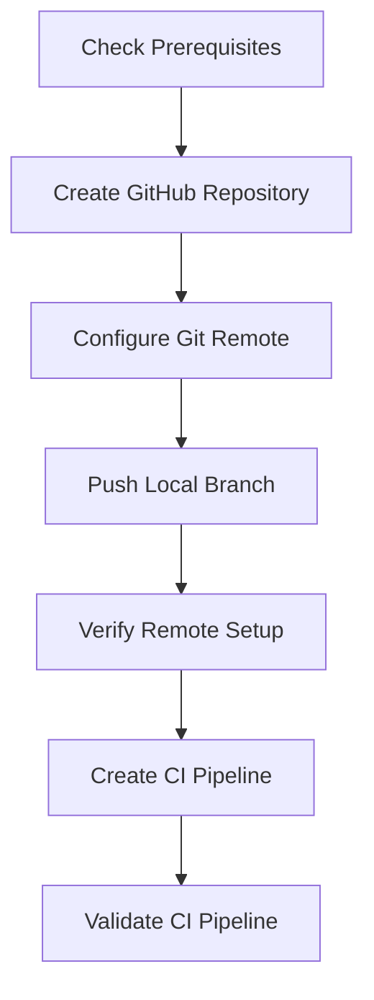
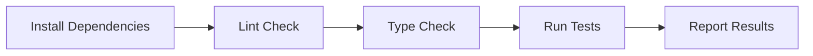

# GitHub Repository Setup and CI Pipeline Design

## Overview
This document outlines the technical design for setting up the GitHub repository `chrisns/matrixbookingmcp` and implementing a comprehensive CI pipeline for automated testing and quality assurance.

## Architecture Components

### 1. Repository Setup Workflow

#### Pre-conditions
- Local repository exists with clean working state
- GitHub CLI (`gh`) is installed and authenticated
- User has appropriate permissions for `chrisns` organization/account

#### Workflow Steps


#### Implementation Strategy
1. **Repository Creation**: Use `gh repo create` with specific flags
2. **Remote Configuration**: Add origin remote, handle existing remotes
3. **Branch Push**: Push main branch with upstream tracking
4. **Verification**: Confirm remote connectivity and branch tracking

### 2. CI Pipeline Architecture

#### GitHub Actions Workflow Structure
```yaml
# .github/workflows/ci.yml
name: Continuous Integration
on:
  push:
    branches: [main]
  pull_request:
    branches: [main]

jobs:
  test:
    strategy:
      matrix:
        os: [ubuntu-latest, windows-latest, macos-latest]
    runs-on: ${{ matrix.os }}
```

#### Pipeline Stages

##### Stage 1: Environment Setup
- **Action**: `actions/checkout@v4`
- **Purpose**: Clone repository code
- **Configuration**: Fetch full history for accurate testing

##### Stage 2: Node.js Environment
- **Action**: `actions/setup-node@v4`  
- **Configuration**: Node.js 22.x
- **Cache Strategy**: npm cache for dependency optimization

##### Stage 3: Dependency Installation
- **Command**: `npm ci`
- **Purpose**: Install exact dependency versions
- **Benefits**: Faster, deterministic installs vs `npm install`

##### Stage 4: Quality Assurance Pipeline


#### Quality Gates
1. **Linting**: `npm run lint` - Code style and quality rules
2. **Type Checking**: `npm run typecheck` - TypeScript compilation
3. **Testing**: `npm test` - Unit and integration test suite

### 3. Cross-Platform Considerations

#### Operating System Matrix
- **Ubuntu Latest**: Primary Linux environment
- **Windows Latest**: Windows compatibility validation  
- **macOS Latest**: Apple ecosystem support

#### Platform-Specific Handling
- **Path Separators**: Handled by Node.js/npm automatically
- **Line Endings**: Git configuration manages CRLF/LF conversion
- **File Permissions**: npm scripts handle cross-platform execution

### 4. Error Handling and Recovery

#### Repository Creation Failures
- **Conflict Resolution**: Handle existing repository scenarios
- **Permission Issues**: Clear error messaging for authentication
- **Network Failures**: Retry logic for transient issues

#### CI Pipeline Failures
- **Dependency Failures**: Clear npm install error reporting
- **Test Failures**: Detailed test output and failure analysis
- **Platform-Specific Issues**: Matrix strategy isolates platform problems

### 5. Security Considerations

#### Repository Security
- **Public Repository**: Code will be publicly accessible
- **Secret Management**: No secrets in repository code
- **Dependency Security**: npm audit integration consideration

#### CI Security
- **Token Permissions**: GitHub Actions tokens have minimal required permissions
- **Dependency Installation**: Use `npm ci` for reproducible builds
- **Environment Isolation**: Each CI run uses fresh environment

## Implementation Details

### GitHub Repository Configuration
```bash
# Repository creation with specific settings
gh repo create chrisns/matrixbookingmcp \
  --public \
  --description "TypeScript MCP server for Matrix Booking API integration" \
  --clone=false
```

### Git Remote Setup
```bash
# Handle existing remotes
if git remote get-url origin 2>/dev/null; then
  git remote rename origin old-origin
fi

# Add new remote
git remote add origin https://github.com/chrisns/matrixbookingmcp.git
git push -u origin main
```

### CI Pipeline Template
```yaml
name: CI
on: [push, pull_request]
jobs:
  test:
    strategy:
      matrix:
        os: [ubuntu-latest, windows-latest, macos-latest]
    runs-on: ${{ matrix.os }}
    steps:
      - uses: actions/checkout@v4
      - uses: actions/setup-node@v4
        with:
          node-version: '22'
          cache: 'npm'
      - run: npm ci
      - run: npm run lint
      - run: npm run typecheck  
      - run: npm test
```

## Success Metrics

### Repository Setup Success
- Repository accessible at `https://github.com/chrisns/matrixbookingmcp`
- Local repository connected to remote
- All commits and history preserved

### CI Pipeline Success
- Workflow executes on push/PR
- All quality checks pass across platforms
- Clear pass/fail status indicators
- Execution time under 10 minutes per platform

## Rollback Strategy

### Repository Setup Rollback
1. Remove remote: `git remote remove origin`
2. Restore original remote if existed
3. Delete GitHub repository via CLI: `gh repo delete chrisns/matrixbookingmcp`

### CI Pipeline Rollback
1. Remove workflow file: `rm .github/workflows/ci.yml`
2. Commit removal to stop CI execution
3. Repository functions normally without CI

## Future Enhancements

### Potential Additions
- **Code Coverage**: Add coverage reporting with codecov
- **Release Automation**: Semantic versioning and automated releases
- **Dependency Updates**: Automated dependency update PRs
- **Performance Testing**: Benchmark integration for performance regression detection

### Monitoring and Maintenance
- **CI Performance**: Monitor build times and optimize as needed
- **Dependency Updates**: Regular security and feature updates
- **Platform Support**: Evaluate additional platform requirements