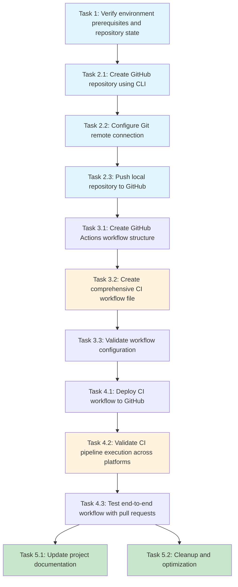

# Implementation Plan

- [ ] 1. Verify environment prerequisites and repository state
  - Verify GitHub CLI is installed and authenticated
  - Check Git configuration and clean working directory
  - Confirm required npm scripts exist (lint, typecheck, test)
  - Check existing remotes and current branch
  - Review commit history and existing GitHub workflows
  - _Requirements: Repository setup prerequisites_

- [ ] 2. Create and configure GitHub repository
  - [ ] 2.1 Create GitHub repository using CLI
    - Execute repository creation command with proper visibility and description
    - Verify repository exists on GitHub with correct settings
    - Document repository URL for reference
    - _Requirements: GitHub repository creation_

  - [ ] 2.2 Configure Git remote connection
    - Handle existing origin remote (rename if exists)
    - Add new origin remote pointing to GitHub repository
    - Verify remote configuration and test connectivity
    - _Requirements: Git remote configuration_

  - [ ] 2.3 Push local repository to GitHub
    - Push main branch with upstream tracking
    - Verify all commits are visible on GitHub
    - Validate branch tracking configuration
    - _Requirements: Code synchronization_

- [ ] 3. Implement CI pipeline infrastructure
  - [ ] 3.1 Create GitHub Actions workflow structure
    - Create .github directory and workflows subdirectory
    - Set up proper directory structure for GitHub Actions
    - Verify directory permissions and structure
    - _Requirements: CI infrastructure setup_

  - [ ] 3.2 Create comprehensive CI workflow file
    - Create ci.yml workflow file with proper triggers
    - Configure matrix strategy for cross-platform testing (Ubuntu, Windows, macOS)
    - Define Node.js 22.x environment setup
    - Add dependency installation, linting, type checking, and testing steps
    - Configure npm caching for performance optimization
    - _Requirements: Automated quality assurance, cross-platform compatibility_

  - [ ] 3.3 Validate workflow configuration
    - Lint YAML syntax and verify action references
    - Confirm npm script references match package.json
    - Review workflow permissions and security settings
    - _Requirements: Configuration validation_

- [ ] 4. Deploy and verify CI pipeline with continuous monitoring
  - [ ] 4.1 Deploy CI workflow to GitHub
    - Commit and push workflow file to GitHub
    - Monitor initial workflow execution using `gh run list` and `gh run watch`
    - Verify workflow appears in Actions tab
    - _Requirements: CI deployment_

  - [ ] 4.2 Monitor and fix CI pipeline until successful build
    - Watch CI execution in real-time using `gh run watch <run-id>`
    - Monitor Ubuntu, Windows, and macOS workflow execution
    - If builds fail, analyze failure logs using `gh run view <run-id> --log`
    - Make necessary fixes to code, configuration, or workflow
    - Push fixes and continue monitoring with `gh run list --limit 1`
    - Repeat fix-push-monitor cycle until all platform builds succeed
    - Verify all quality checks pass (linting, type checking, testing)
    - _Requirements: Cross-platform validation, quality assurance, iterative improvement_

  - [ ] 4.3 Test end-to-end workflow with pull requests
    - Create test branch and make minimal code change
    - Create pull request and verify CI execution with `gh pr checks`
    - Monitor PR status checks using `gh pr status`
    - Fix any PR-specific CI failures and push additional commits
    - Confirm all status checks pass and merge protection works
    - _Requirements: Pull request integration, continuous monitoring_

- [ ] 5. Update documentation and cleanup
  - [ ] 5.1 Update project documentation
    - Update README.md with new repository URL and CI badge
    - Update package.json repository field
    - Document CI workflow in project documentation
    - _Requirements: Documentation updates_

  - [ ] 5.2 Cleanup and optimization
    - Remove temporary files created during setup
    - Optimize workflow caching configuration
    - Review git configuration and verify no sensitive information exposure
    - _Requirements: Security and optimization_

## Tasks Dependency Diagram

