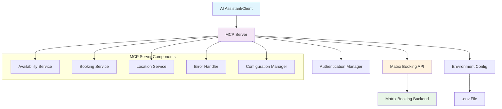
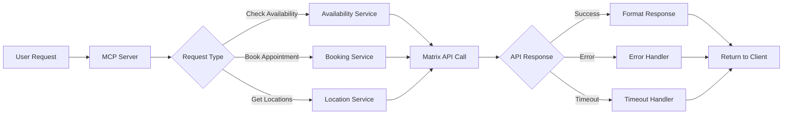
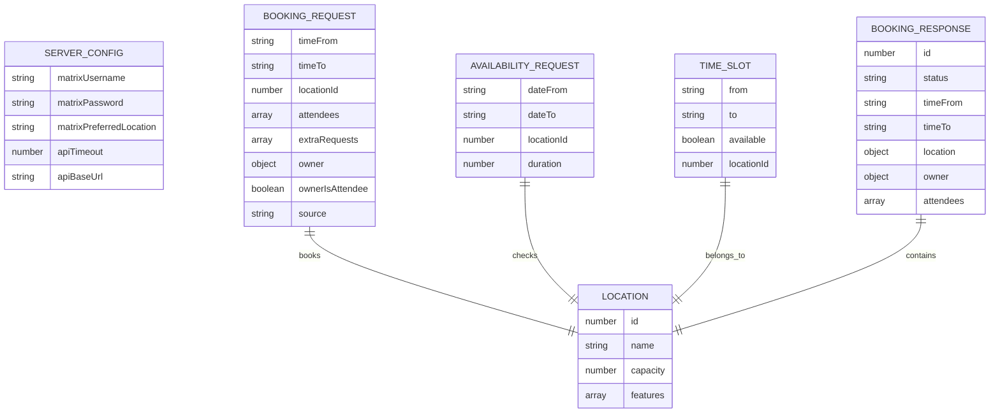
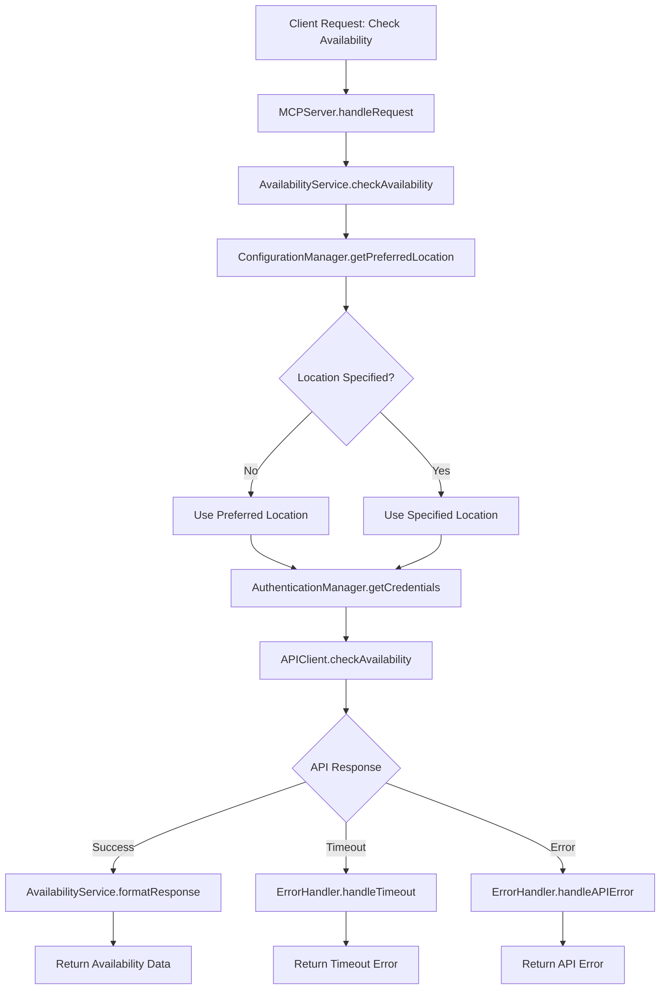
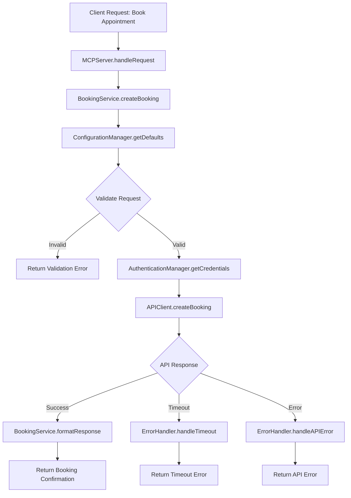
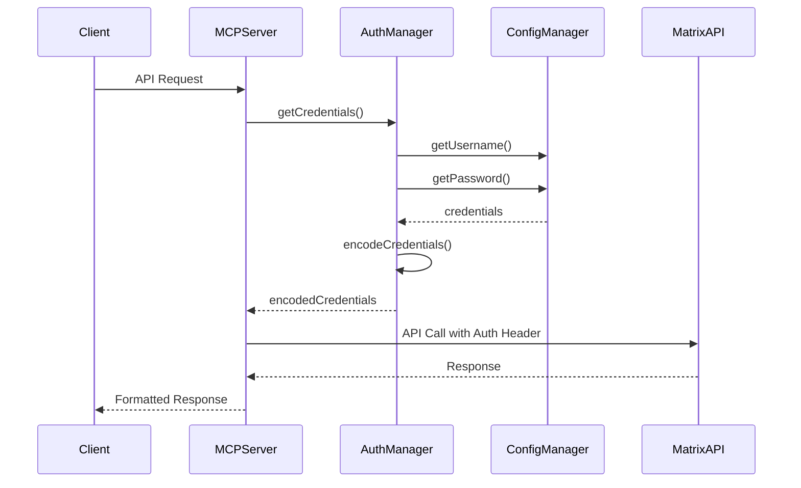
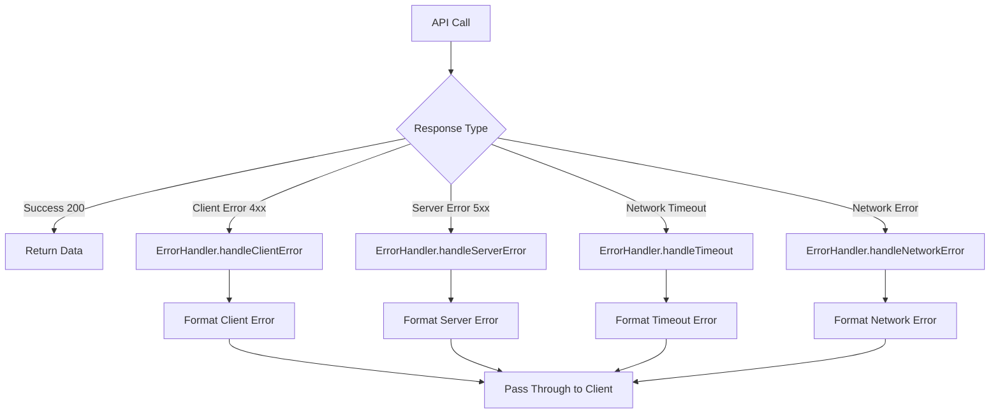

# Matrix Booking MCP Server - Design Document

## Overview

The Matrix Booking MCP (Model Context Protocol) Server is a TypeScript-based server that provides seamless integration between AI assistants and the Matrix Booking system. The server enables users to check room availability, book appointments, and manage bookings through natural language interactions while maintaining security and reliability.

### Design Goals
- **Stateless Architecture**: No caching or persistent state management
- **Environment-based Configuration**: Secure credential management via .env files
- **Robust Error Handling**: Pass-through error handling with proper timeout management
- **Comprehensive Testing**: Full test coverage with API mocking
- **Smart Defaults**: Intuitive date and location defaults for user convenience
- **Type Safety**: Full TypeScript implementation with strict typing

### Scope
- Room availability checking
- Appointment booking functionality  
- Location management
- Authentication and authorization
- Error handling and timeout management
- Comprehensive testing infrastructure

## Architecture Design

### System Architecture Diagram



### Data Flow Diagram



## Component Design

### MCP Server Core
- **Responsibilities**: Protocol handling, message routing, session management
- **Interfaces**: 
  - `IMCPServer`: Main server interface
  - `ITransport`: Communication transport abstraction
- **Dependencies**: @modelcontextprotocol/sdk, stdio transport

### Authentication Manager
- **Responsibilities**: HTTP Basic Authentication, credential management, token handling
- **Interfaces**:
  - `IAuthenticationManager`: Authentication operations
  - `ICredentials`: Credential structure
- **Dependencies**: Environment configuration, base64 encoding utilities

### Availability Service  
- **Responsibilities**: Check room/location availability for specified date/time ranges
- **Interfaces**:
  - `IAvailabilityService`: Availability checking operations
  - `IAvailabilityRequest`: Request parameters
  - `IAvailabilityResponse`: Response structure
- **Dependencies**: Matrix API client, configuration manager

### Booking Service
- **Responsibilities**: Create, modify, cancel bookings
- **Interfaces**:
  - `IBookingService`: Booking operations
  - `IBookingRequest`: Booking parameters
  - `IBookingResponse`: Booking confirmation
- **Dependencies**: Matrix API client, authentication manager

### Location Service
- **Responsibilities**: Retrieve location information, manage preferred locations
- **Interfaces**:
  - `ILocationService`: Location operations
  - `ILocation`: Location data structure
- **Dependencies**: Matrix API client, configuration

### Configuration Manager
- **Responsibilities**: Environment variable management, default value provision
- **Interfaces**:
  - `IConfigurationManager`: Configuration operations
  - `IServerConfig`: Server configuration structure
- **Dependencies**: dotenv, environment validation

### API Client
- **Responsibilities**: HTTP requests to Matrix Booking API, timeout handling, response parsing
- **Interfaces**:
  - `IMatrixAPIClient`: API communication interface
  - `IAPIRequest`: Request structure
  - `IAPIResponse`: Response structure
- **Dependencies**: fetch API, authentication manager

### Error Handler
- **Responsibilities**: Error classification, pass-through error handling, timeout management
- **Interfaces**:
  - `IErrorHandler`: Error handling operations
  - `IErrorResponse`: Standardized error structure
- **Dependencies**: None (pure error processing)

## Data Model

### Core Data Structure Definitions

```typescript
interface IServerConfig {
  matrixUsername: string;
  matrixPassword: string;
  matrixPreferredLocation: string;
  apiTimeout: number;
  apiBaseUrl: string;
}

interface ICredentials {
  username: string;
  password: string;
  encodedCredentials: string;
}

interface IAvailabilityRequest {
  dateFrom: string;  // ISO 8601 format
  dateTo: string;    // ISO 8601 format
  locationId?: number;
  duration?: number; // minutes
}

interface IAvailabilityResponse {
  available: boolean;
  slots: ITimeSlot[];
  location: ILocation;
}

interface ITimeSlot {
  from: string;      // ISO 8601 format
  to: string;        // ISO 8601 format
  available: boolean;
  locationId: number;
}

interface IBookingRequest {
  timeFrom: string;  // ISO 8601 format
  timeTo: string;    // ISO 8601 format
  locationId: number;
  attendees: IAttendee[];
  extraRequests: string[];
  owner: IOwner;
  ownerIsAttendee: boolean;
  source: string;
}

interface IBookingResponse {
  id: number;
  status: 'CONFIRMED' | 'PENDING' | 'CANCELLED';
  timeFrom: string;
  timeTo: string;
  location: ILocation;
  owner: IOwner;
  attendees: IAttendee[];
}

interface ILocation {
  id: number;
  name: string;
  capacity?: number;
  features?: string[];
}

interface IAttendee {
  id?: number;
  email: string;
  name: string;
}

interface IOwner {
  id: number;
  email: string;
  name: string;
}

interface IAPIError {
  code: string;
  message: string;
  details?: any;
  timestamp: string;
}
```

### Data Model Diagram



## Business Process

### Process 1: Check Availability



### Process 2: Book Appointment



### Process 3: Authentication Flow



### Process 4: Error Handling Flow



## Error Handling Strategy

### Error Classification
- **Network Errors**: Connection failures, timeouts, DNS resolution issues
- **Authentication Errors**: Invalid credentials, expired tokens, authorization failures  
- **Validation Errors**: Invalid request parameters, missing required fields
- **API Errors**: Matrix Booking API-specific errors, rate limiting
- **System Errors**: Configuration issues, environment problems

### Timeout Management
- **API Call Timeout**: 5-second maximum for upstream API calls
- **Connection Timeout**: 3-second maximum for initial connection establishment
- **Graceful Degradation**: Return meaningful error messages on timeout

### Pass-through Error Policy
- **No Custom Error Formatting**: Preserve original Matrix API error messages
- **Error Code Preservation**: Maintain HTTP status codes from upstream API
- **Context Addition**: Add minimal context (timestamp, request ID) without altering core error

### Recovery Mechanisms
- **Retry Logic**: No automatic retries (stateless requirement)
- **Circuit Breaker**: Not implemented (stateless architecture)
- **Fallback Responses**: Provide helpful error messages with suggested actions

## Testing Strategy

### Unit Testing Framework
- **Primary Framework**: Vitest 3 (2025 best practices)
- **Type Safety**: Full TypeScript integration with strict typing
- **Coverage Target**: Minimum 90% code coverage

### Integration Testing
- **API Mocking**: Mock Service Worker (MSW) for network-level mocking
- **Transport Testing**: Test MCP protocol communication
- **End-to-End Scenarios**: Complete user journey testing

### Test Structure
```
tests/
├── unit/
│   ├── services/
│   │   ├── availability.service.test.ts
│   │   ├── booking.service.test.ts
│   │   └── location.service.test.ts
│   ├── managers/
│   │   ├── auth.manager.test.ts
│   │   └── config.manager.test.ts
│   └── utils/
│       ├── error.handler.test.ts
│       └── api.client.test.ts
├── integration/
│   ├── mcp-server.integration.test.ts
│   ├── matrix-api.integration.test.ts
│   └── end-to-end.test.ts
└── mocks/
    ├── matrix-api.mock.ts
    ├── mcp-transport.mock.ts
    └── test-data.ts
```

### Mock Strategy
- **Matrix API Mocking**: Complete API response mocking using MSW
- **Environment Mocking**: Test configuration with various .env scenarios  
- **Transport Mocking**: Mock MCP communication layer
- **Error Simulation**: Test all error conditions and edge cases

### Performance Testing
- **Load Testing**: K6 scripts for HTTP transport testing
- **Memory Profiling**: Monitor memory usage during extended operation
- **Timeout Testing**: Verify 5-second timeout enforcement

### Test Data Management
- **Realistic Test Data**: Use actual Matrix API response formats
- **Edge Case Coverage**: Test boundary conditions and invalid inputs
- **Security Testing**: Validate credential handling and sanitization

Does the design look good? If so, we can move on to the implementation plan.