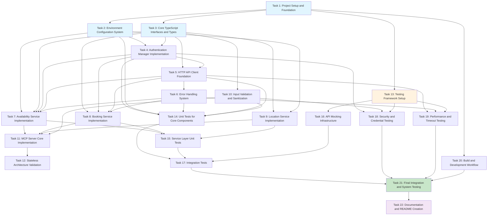

# Implementation Plan - Matrix Booking MCP Server

This document outlines the step-by-step implementation tasks for building the Matrix Booking MCP Server. Each task is designed to be completed incrementally with semantic commits between steps.

## Implementation Tasks

- [x] 1. Project Setup and Foundation
  - Initialize TypeScript project structure with proper configuration
  - Set up package.json with MCP SDK and required dependencies using pnpm
  - Configure TypeScript compiler options and build settings
  - Create .gitignore with Node.js, TypeScript, pnpm-lock.yaml, and environment file exclusions
  - _Requirements: 10.3, 10.4, 2.4_

- [ ] 2. Environment Configuration System
  - Create configuration manager interface and implementation
  - Implement environment variable loading with dotenv
  - Add validation for required environment variables (MATRIX_USERNAME, MATRIX_PASSWORD, MATRIX_PREFERED_LOCATION)
  - Create .env.example template file with configuration documentation
  - Add startup validation with descriptive error messages for missing variables
  - _Requirements: 2.1, 2.2, 2.3, 2.5_

- [ ] 3. Core TypeScript Interfaces and Types
  - Define core data model interfaces (IServerConfig, ICredentials, ILocation)
  - Create availability service interfaces (IAvailabilityRequest, IAvailabilityResponse, ITimeSlot)
  - Implement booking service interfaces (IBookingRequest, IBookingResponse, IAttendee, IOwner)
  - Define error handling interfaces (IAPIError, IErrorResponse)
  - Create MCP server and transport interfaces
  - _Requirements: 1.2, 11.1, 11.2, 11.3_

- [ ] 4. Authentication Manager Implementation
  - Create authentication manager with credential handling
  - Implement HTTP Basic Authentication header generation
  - Add secure credential encoding without persistent storage
  - Create authentication manager unit tests with credential validation
  - Ensure no logging of sensitive authentication data
  - _Requirements: 5.1, 5.2, 5.3, 5.5_

- [ ] 5. HTTP API Client Foundation
  - Implement Matrix Booking API client with fetch-based HTTP requests
  - Add 5-second timeout configuration for all API calls
  - Create request/response interfaces for API communication
  - Implement authentication header injection for API requests
  - Add basic error response handling structure
  - _Requirements: 8.3, 5.2, 3.5, 4.5_

- [ ] 6. Error Handling System
  - Create error handler with pass-through error policy
  - Implement timeout error handling with descriptive messages
  - Add HTTP status code preservation from upstream API
  - Create error classification system (network, auth, validation, API, system)
  - Ensure raw API error responses are passed through without modification
  - _Requirements: 8.2, 8.6, 8.1, 8.4_

- [ ] 7. Availability Service Implementation
  - Create availability service with Matrix API integration
  - Implement date defaulting to current date when not specified
  - Add location defaulting to MATRIX_PREFERED_LOCATION from environment
  - Create availability request validation and formatting
  - Add availability response parsing and structuring
  - _Requirements: 3.1, 3.2, 3.3, 3.4, 3.6_

- [ ] 8. Booking Service Implementation
  - Create booking service with POST request handling to Matrix API
  - Implement booking request formatting according to Matrix API specification
  - Add default value application for date (today) and location (preferred)
  - Create booking confirmation response handling
  - Add unavailability error handling for failed bookings
  - _Requirements: 4.1, 4.2, 4.3, 4.4, 4.5_

- [ ] 9. Location Service Implementation
  - Create location service for retrieving location information
  - Implement preferred location management from configuration
  - Add location data structure handling and validation
  - Create location lookup and caching mechanisms
  - Add location validation against allowed values
  - _Requirements: 3.3, 4.5, 11.2_

- [ ] 10. Input Validation and Sanitization
  - Implement date format validation with proper range checking
  - Add time zone handling for time parameters
  - Create location parameter validation against allowed values
  - Implement input sanitization to prevent injection attacks
  - Add API parameter validation before external calls
  - _Requirements: 11.1, 11.3, 11.4, 11.5_

- [ ] 11. MCP Server Core Implementation
  - Implement MCP protocol-compliant server using @modelcontextprotocol/sdk
  - Create stdio transport configuration for MCP communication
  - Add MCP message routing to appropriate services
  - Implement request parameter validation according to MCP standards
  - Create MCP-compliant endpoint exposure for Matrix Booking operations
  - _Requirements: 1.1, 1.3, 1.4, 6.1, 6.2_

- [ ] 12. Stateless Architecture Validation
  - Ensure no session or state storage between requests
  - Validate independent request processing without shared state
  - Remove any potential caching mechanisms to maintain stateless design
  - Add request ID generation for traceability without persistence
  - Verify horizontal scaling compatibility with stateless architecture
  - _Requirements: 6.1, 6.2, 6.3, 6.4, 6.5, 8.5_

- [ ] 13. Testing Framework Setup
  - Set up Vitest 3 testing framework with TypeScript integration
  - Configure test coverage reporting to achieve 90% minimum coverage
  - Install and configure Mock Service Worker (MSW) for API mocking
  - Create test structure directories (unit, integration, mocks)
  - Set up test data management with realistic Matrix API response formats
  - _Requirements: 7.1, 7.2, 7.4, 7.6_

- [ ] 14. Unit Tests for Core Components
  - Write authentication manager unit tests with credential validation scenarios
  - Create configuration manager unit tests with environment variable validation
  - Implement error handler unit tests with pass-through error scenarios
  - Write API client unit tests with timeout and authentication testing
  - Add input validation unit tests with edge cases and boundary conditions
  - _Requirements: 7.3, 7.5_

- [ ] 15. Service Layer Unit Tests
  - Create availability service unit tests with date/location defaulting scenarios
  - Write booking service unit tests with request formatting and response handling
  - Implement location service unit tests with preferred location management
  - Add comprehensive error scenarios for all service layer components
  - Test smart defaults implementation for date and location parameters
  - _Requirements: 7.3, 7.5_

- [ ] 16. API Mocking Infrastructure
  - Create comprehensive Matrix Booking API mocks using Mock Service Worker
  - Implement success response scenarios for availability and booking endpoints
  - Add error response mocks for various failure conditions (401, 403, 404, 500)
  - Create timeout simulation for testing 5-second timeout handling
  - Add realistic test data with anonymized booking information
  - _Requirements: 7.2, 7.5, 7.6_

- [ ] 17. Integration Tests
  - Write MCP server integration tests with complete request/response flow
  - Create Matrix API integration tests with mocked external dependencies
  - Implement end-to-end scenario tests covering availability and booking workflows
  - Add authentication flow integration tests with environment configuration
  - Test error propagation through the complete system stack
  - _Requirements: 7.4_

- [ ] 18. Security and Credential Testing
  - Create tests for secure credential handling without persistent storage
  - Implement authentication failure testing with proper HTTP error codes
  - Add input sanitization testing to prevent injection attacks
  - Test sensitive data exclusion from logging and error messages
  - Verify environment variable security and .env file exclusion
  - _Requirements: 5.4, 5.5, 11.4_

- [ ] 19. Performance and Timeout Testing
  - Implement timeout testing to verify 5-second API call limits
  - Create performance tests for memory usage during extended operation
  - Add load testing scenarios using K6 for HTTP transport testing
  - Test timeout error handling and graceful degradation
  - Verify stateless architecture performance characteristics
  - _Requirements: 8.3_

- [ ] 20. Build and Development Workflow
  - Configure TypeScript compilation and build scripts using pnpm
  - Set up development scripts for testing and linting with pnpm scripts
  - Create semantic commit message validation
  - Add pnpm-lock.yaml dependency lock file management for reproducible builds
  - Configure continuous integration preparation scripts with pnpm caching
  - _Requirements: 10.1, 10.2, 10.5_

- [ ] 21. Final Integration and System Testing
  - Run comprehensive test suite to verify 90% code coverage achievement
  - Execute full integration testing with all components working together
  - Validate MCP protocol compliance with official specifications
  - Test complete availability and booking workflows with realistic scenarios
  - Verify error handling, timeout management, and pass-through error policies
  - _Requirements: 7.1, 1.1, 8.2, 8.3_

- [ ] 22. Documentation and README Creation
  - Create comprehensive README.md file with clear project description and purpose
  - Add detailed installation instructions including Node.js version requirements and pnpm installation
  - Document configuration requirements including all environment variables with examples
  - Write usage instructions with practical examples for availability checking and booking operations
  - Include MCP integration documentation with setup instructions for Claude Desktop or other MCP clients
  - Add troubleshooting section with common issues and solutions
  - Document API endpoints and their expected inputs/outputs with examples
  - Include contribution guidelines with coding standards, testing requirements, and PR workflow using pnpm
  - Add license information and project maintainer contact details
  - Create badges for build status, test coverage, and version information
  - Include architecture overview with high-level system diagram
  - Document security considerations and best practices for credential management
  - _Requirements: 10.4, 1.1, 2.1, 5.5_

## Tasks Dependency Diagram

