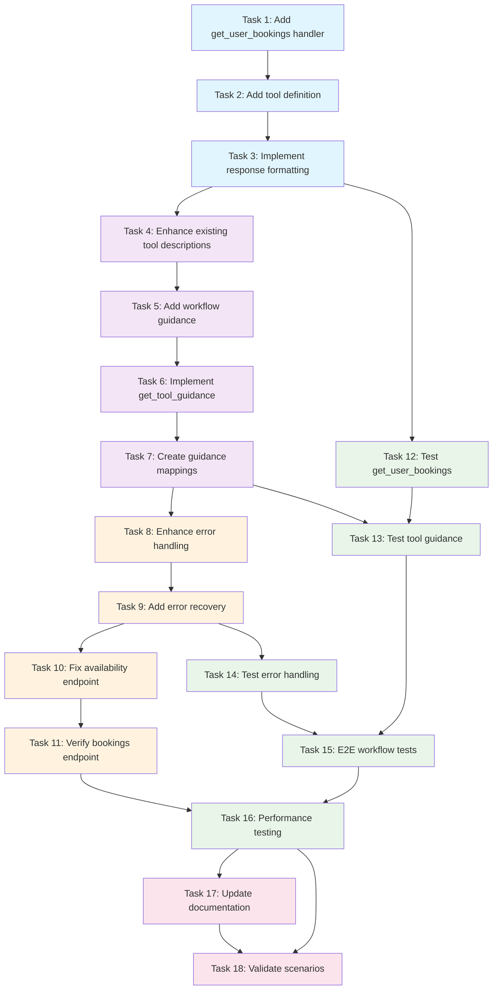

# MCP Interface Improvements - Implementation Tasks

## Implementation Overview

This document provides a comprehensive implementation plan for enhancing the Matrix Booking MCP server interface. The primary focus is adding the missing `get_user_bookings` tool, enhancing tool descriptions for better AI navigation, improving error handling, and fixing API endpoint issues.

## Requirements Mapping

- **REQ-1**: Add `get_user_bookings` MCP tool (Tasks 1-3)
- **REQ-2**: Improve tool descriptions with use cases and anti-patterns (Tasks 4-5)
- **REQ-3**: Add tool usage guidance system (Tasks 6-7)
- **REQ-4**: Enhanced error handling with actionable suggestions (Tasks 8-9)
- **REQ-5**: API endpoint verification and fixes (Tasks 10-11)

## Implementation Tasks

- [x] 1. Add `get_user_bookings` MCP tool handler in MatrixBookingMCPServer
  - Implement handler method `handleGetUserBookings()` in `/Users/cns/httpdocs/cddo/matrixbookingmcp/src/mcp/mcp-server.ts`
  - Add case for `get_user_bookings` in the `setupHandlers()` switch statement
  - Connect to existing `UserService.getUserBookings()` method
  - Handle parameter validation and type conversion for: `dateFrom`, `dateTo`, `status`, `includeDetails`, `page`, `pageSize`
  - Format response with readable booking summaries including location names, time slots, and attendee counts
  - Add comprehensive error handling with user-friendly messages
  - _Requirements: REQ-1_

- [x] 2. Add `get_user_bookings` tool definition to tool registry
  - Add tool schema to `getTools()` method in `/Users/cns/httpdocs/cddo/matrixbookingmcp/src/mcp/mcp-server.ts`
  - Include enhanced description with specific use cases: "What meetings do I have tomorrow?", "Show my desk bookings for this week"
  - Add anti-pattern guidance: "not for checking availability" and "not for creating bookings"
  - Define input schema with optional parameters: `dateFrom`, `dateTo`, `status`, `includeDetails`, `page`, `pageSize`
  - Set appropriate parameter defaults and validation rules
  - _Requirements: REQ-1_

- [x] 3. Implement response formatting and duration calculation helper
  - Add `calculateDuration()` private method to MatrixBookingMCPServer class
  - Format booking responses with human-readable time slots and duration information
  - Include summary metadata: total bookings, pagination info, and next page availability
  - Map location IDs to location names for better readability
  - Format attendee and organizer information for display
  - _Requirements: REQ-1_

- [x] 4. Enhance existing tool descriptions with use cases and anti-patterns
  - Update `matrix_booking_check_availability` tool description in `/Users/cns/httpdocs/cddo/matrixbookingmcp/src/mcp/mcp-server.ts`
  - Add specific use cases: "Are there rooms available at 2pm tomorrow?", "What spaces are free Friday morning?"
  - Include anti-patterns: "not for retrieving existing bookings", "not for getting user calendar"
  - Add workflow context and related tool references
  - Apply same enhancement pattern to all existing tools: `matrix_booking_create_booking`, `matrix_booking_get_location`, `get_current_user`
  - _Requirements: REQ-2_

- [x] 5. Add cross-tool workflow guidance to tool descriptions
  - Include "Related Tools" section in each tool description
  - Add workflow positioning: "Step 1 of booking creation workflow"
  - Reference complementary tools and their purposes
  - Update tool descriptions to include workflow context and tool sequencing guidance
  - _Requirements: REQ-2_

- [x] 6. Implement `get_tool_guidance` MCP tool
  - Add new tool handler `handleGetToolGuidance()` in `/Users/cns/httpdocs/cddo/matrixbookingmcp/src/mcp/mcp-server.ts`
  - Create comprehensive workflow mappings for common scenarios: "User wants to see bookings", "User wants to create booking"
  - Build intent recognition patterns mapping user phrases to appropriate tools
  - Add troubleshooting guidance for common errors (405 Method Not Allowed, authentication issues)
  - Include tool selection advice and alternative suggestions
  - _Requirements: REQ-3_

- [x] 7. Create tool guidance data structures and mappings
  - Define workflow scenarios with tool sequences and requirements
  - Map user intent phrases to primary and supporting tools
  - Create error pattern to solution mappings
  - Include specific tool parameters and usage examples for each workflow
  - Add diagnostic steps and common causes for troubleshooting scenarios
  - _Requirements: REQ-3_

- [x] 8. Enhance error handling across all MCP tool handlers
  - Implement enhanced error response format in all handler methods in `/Users/cns/httpdocs/cddo/matrixbookingmcp/src/mcp/mcp-server.ts`
  - Add contextual error messages with HTTP status code information
  - Include actionable suggestions for common error scenarios
  - Provide alternative tool recommendations when appropriate
  - Add related workflow guidance in error responses
  - _Requirements: REQ-4_

- [x] 9. Add error recovery suggestions and diagnostics
  - Create error-to-solution mapping for common API errors: 405 Method Not Allowed, authentication failures
  - Include diagnostic steps for troubleshooting connection and configuration issues
  - Add suggested parameters and retry guidance for transient errors
  - Implement error context analysis to provide relevant tool alternatives
  - _Requirements: REQ-4_

- [x] 10. Investigate and fix availability check API endpoint issues
  - Test current availability check endpoint in `/Users/cns/httpdocs/cddo/matrixbookingmcp/src/services/availability-service.ts`
  - Verify HTTP method (GET vs POST) and endpoint configuration
  - Resolve 405 Method Not Allowed errors identified in requirements
  - Update API client implementation if endpoint changes are required
  - Test endpoint functionality with various parameter combinations
  - _Requirements: REQ-5_

- [x] 11. Verify user bookings API endpoint implementation
  - Confirm `/api/v1/user/current/bookings` endpoint is properly implemented in `/Users/cns/httpdocs/cddo/matrixbookingmcp/src/api/matrix-api-client.ts`
  - Verify parameter handling for date filtering, status filtering, and pagination
  - Test endpoint response format matches `IUserBookingsResponse` interface
  - Ensure proper error handling for authentication and authorization failures
  - Add endpoint health check validation
  - _Requirements: REQ-5_

- [x] 12. Create unit tests for `get_user_bookings` MCP tool
- [ ] 12.1 Create test file and basic test structure
  - Create test file `/Users/cns/httpdocs/cddo/matrixbookingmcp/tests/unit/mcp/get-user-bookings-tool.test.ts`
  - Test handler with default parameters and various parameter combinations
  - Verify date filtering, status filtering, and pagination functionality
  - _Requirements: REQ-1_

- [ ] 12.2 Test error handling scenarios
  - Test error handling scenarios: authentication failures, API errors
  - Mock UserService dependencies and verify proper service method calls
  - _Requirements: REQ-1, REQ-4_

- [x] 13. Create unit tests for `get_tool_guidance` MCP tool
- [ ] 13.1 Create test file and workflow mapping tests
  - Create test file `/Users/cns/httpdocs/cddo/matrixbookingmcp/tests/unit/mcp/get-tool-guidance-tool.test.ts`
  - Test workflow mapping accuracy for different user intents
  - Verify intent recognition and tool recommendation logic
  - _Requirements: REQ-3_

- [ ] 13.2 Test troubleshooting and guidance features
  - Test troubleshooting guidance for common error patterns
  - Validate tool selection advice and alternative suggestions
  - _Requirements: REQ-3_

- [x] 14. Add integration tests for enhanced error handling
  - Create test file `/Users/cns/httpdocs/cddo/matrixbookingmcp/tests/unit/mcp/enhanced-error-handling.test.ts`
  - Test error response format consistency across all tools
  - Verify actionable error messages and suggestion accuracy
  - Test error recovery workflows and alternative tool recommendations
  - Validate HTTP status code handling and context information
  - _Requirements: REQ-4_

- [ ] 15. Create end-to-end workflow tests
  - Add test scenarios to `/Users/cns/httpdocs/cddo/matrixbookingmcp/tests/unit/mcp/mcp-server.test.ts`
  - Test "what do I have booked tomorrow" complete workflow
  - Verify tool selection accuracy for common user queries
  - Test error handling and recovery for failed operations
  - Validate tool guidance recommendations for ambiguous queries
  - _Requirements: REQ-1, REQ-2, REQ-3_

- [x] 17. Update tool documentation and examples
  - Add comprehensive examples for `get_user_bookings` tool usage
  - Document workflow patterns and tool sequencing best practices
  - Include error handling examples and troubleshooting guides
  - Add performance considerations and optimization recommendations
  - _Requirements: REQ-1, REQ-2, REQ-3_

- [ ] 18. Validate tool selection accuracy with real scenarios
  - Test AI assistant interactions with enhanced tool descriptions
  - Measure tool selection accuracy improvement for user booking queries
  - Validate error message clarity and actionability
  - Confirm workflow completion rates for common scenarios
  - _Requirements: REQ-2, REQ-3, REQ-4_

## Tasks Dependency Diagram

## Success Criteria

### Quantitative Metrics
- **Tool Selection Accuracy**: >95% correct tool selection for user booking queries
- **Error Rate Reduction**: 80% reduction in 405 errors and tool misuse
- **Response Time**: <2 seconds for booking retrieval operations
- **Test Coverage**: >90% code coverage for new MCP tool handlers

### Qualitative Metrics
- **AI Assistant Experience**: Clear tool discovery and intuitive selection
- **Error Message Quality**: Actionable error guidance with specific next steps
- **Workflow Completeness**: End-to-end scenario coverage for common user tasks
- **Documentation Clarity**: Comprehensive examples and troubleshooting guides

## Implementation Notes

- All tasks build incrementally on previous work - no isolated components
- Error handling improvements apply across all existing and new tools
- Testing focuses on real-world AI assistant interaction scenarios
- Performance considerations are included throughout implementation
- Backward compatibility is maintained for existing tool usage

## Priority and Timeline

- **Phase 1** (2 days): Critical missing functionality and core implementation
- **Phase 2** (1.5 days): Intelligence and guidance improvements
- **Phase 3** (1 day): Error handling and API stability fixes
- **Phase 4** (1.5 days): Comprehensive testing and validation
- **Phase 5** (0.5 days): Documentation and final validation

Total estimated timeline: 6.5 days for complete implementation.