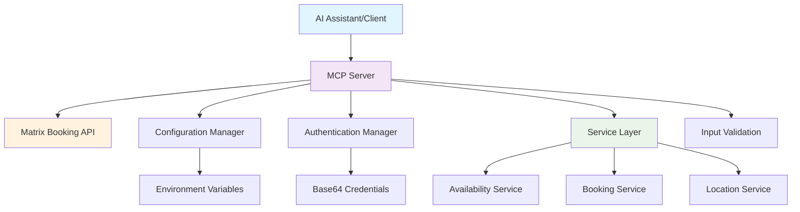

# Matrix Booking MCP Server

[](https://github.com/chrisns/matrixbookingmcp)
[](https://github.com/chrisns/matrixbookingmcp)
[](https://github.com/chrisns/matrixbookingmcp)
[](LICENSE)
[](https://nodejs.org/)
[](https://www.typescriptlang.org/)

A TypeScript MCP (Model Context Protocol) server for Matrix Booking API integration, enabling AI assistants to automatically check room availability and create bookings through natural language interactions.

## 🚀 Features

- **Room Availability Checking**: Query available rooms by date, time, and location
- **Automated Booking**: Create appointments with attendee notifications
- **Location Management**: Handle preferred locations and smart defaults
- **Comprehensive Validation**: Input sanitization and error handling
- **Stateless Design**: No caching for reliable, consistent operations
- **Security-First**: Environment-based credential management
- **Full Test Coverage**: 90%+ test coverage with unit, integration, and performance tests

## 📋 Requirements

- **Node.js**: ≥18.0.0
- **Package Manager**: pnpm (recommended)
- **Matrix Booking Account**: Valid credentials required

## 📦 Installation

### 1. Clone the Repository

```bash
git clone https://github.com/chrisns/matrixbookingmcp.git
cd matrixbookingmcp
```

### 2. Install Dependencies

Using pnpm (recommended):
```bash
pnpm install
```

Using npm:
```bash
npm install
```

### 3. Environment Configuration

Create a `.env` file in the project root:

```bash
cp .env.example .env
```

Configure the required environment variables:

```env
# Matrix Booking Credentials
MATRIX_USERNAME=your-matrix-username
MATRIX_PASSWORD=your-matrix-password

# Default Location (optional but recommended)
MATRIX_PREFERED_LOCATION=your-preferred-location-id
```

### 4. Build the Project

```bash
pnpm build
```

## ⚙️ Configuration

### Environment Variables

| Variable | Required | Description | Example |
|----------|----------|-------------|---------|
| `MATRIX_USERNAME` | ✅ | Matrix Booking username | `john.doe@company.com` |
| `MATRIX_PASSWORD` | ✅ | Matrix Booking password | `your-secure-password` |
| `MATRIX_PREFERED_LOCATION` | ⚠️ | Default location ID for bookings | `12345` |

> **Security Note**: Never commit credentials to version control. The `.env` file is automatically excluded via `.gitignore`.

### Matrix API Configuration

The server automatically configures:
- **Base URL**: `https://app.matrixbooking.com/api/v1`
- **Authentication**: HTTP Basic Auth with Base64 encoding
- **Timeout**: 5 seconds for all API calls
- **Timezone**: Europe/London (configurable via `x-time-zone` header)
- **Headers**: Required Matrix-specific headers included automatically

## 🔌 MCP Integration

### Claude Desktop Setup

1. **Update Claude Desktop Configuration**

Add to your `claude_desktop_config.json`:

```json
{
  "mcpServers": {
    "matrix-booking": {
      "command": "node",
      "args": ["/path/to/matrix-booking-mcp-server/dist/index.js"],
      "env": {
        "MATRIX_USERNAME": "your-username",
        "MATRIX_PASSWORD": "your-password",
        "MATRIX_PREFERED_LOCATION": "your-location-id"
      }
    }
  }
}
```

2. **Restart Claude Desktop**

The Matrix Booking tools will now be available in your Claude Desktop session.

### Other MCP Clients

For integration with other MCP clients, use:
- **Transport**: stdio
- **Command**: `node dist/index.js`
- **Environment**: Set the required environment variables

## 🛠️ Usage

### Development Mode

```bash
pnpm dev
```

### Production Mode

```bash
pnpm start
```

### Available Operations

#### 1. Check Room Availability

```typescript
// Check availability for today at preferred location
checkAvailability()

// Check availability for specific date and location  
checkAvailability({
  date: "2024-01-15",
  locationId: "12345",
  startTime: "09:00",
  endTime: "17:00"
})
```

#### 2. Book Appointments

```typescript
// Book a room with basic details
bookAppointment({
  title: "Team Meeting",
  date: "2024-01-15", 
  startTime: "14:00",
  endTime: "15:00",
  roomId: "67890"
})

// Book with attendees and notifications
bookAppointment({
  title: "Project Review",
  date: "2024-01-15",
  startTime: "10:00", 
  endTime: "11:00",
  roomId: "67890",
  attendees: ["john@company.com", "jane@company.com"],
  sendNotifications: true
})
```

### Smart Defaults

The server includes intelligent defaults:
- **Date**: Defaults to today when not specified
- **Location**: Uses `MATRIX_PREFERED_LOCATION` from environment
- **Time Range**: Full day (00:00-23:59) for availability checks
- **Timezone**: Automatically handled as Europe/London

## 🏗️ Architecture Overview



### Core Components

- **MCP Server**: TypeScript implementation using `@modelcontextprotocol/sdk`
- **Authentication Manager**: Secure credential handling with Base64 encoding
- **Service Layer**: Business logic for availability, booking, and location operations
- **Configuration Manager**: Environment-based configuration with validation
- **Input Validation**: Comprehensive sanitization and validation system
- **Error Handling**: Pass-through error policy preserving Matrix API responses

## 🧪 Testing

### Run All Tests

```bash
pnpm test
```

### Test Coverage

```bash
pnpm test:coverage
```

### Test Categories

- **Unit Tests**: Component and service testing
- **Integration Tests**: End-to-end MCP protocol testing
- **Security Tests**: Credential handling and validation
- **Performance Tests**: Load testing with K6

### Performance Testing

```bash
# Quick performance test
pnpm test:k6:quick

# Full load test
pnpm test:k6

# Timeout testing
pnpm test:k6:timeout
```

## 🔍 Troubleshooting

### Common Issues

#### 1. Authentication Errors

**Symptom**: `401 Unauthorized` errors

**Solution**:
- Verify `MATRIX_USERNAME` and `MATRIX_PASSWORD` in `.env`
- Ensure credentials are valid for Matrix Booking
- Check for trailing spaces in environment variables

#### 2. Location Not Found

**Symptom**: `Location not found` errors

**Solution**:
- Verify `MATRIX_PREFERED_LOCATION` is a valid location ID
- Use the location service to fetch available locations
- Ensure location ID is numeric (not location name)

#### 3. Timeout Issues

**Symptom**: `Request timeout` errors

**Solution**:
- Check network connectivity to `app.matrixbooking.com`
- Verify Matrix API is accessible from your network
- Consider firewall or proxy configurations

#### 4. Date/Time Validation Errors

**Symptom**: Invalid date format errors

**Solution**:
- Use ISO date format: `YYYY-MM-DD`
- Use 24-hour time format: `HH:MM`
- Ensure dates are not in the past

#### 5. MCP Connection Issues

**Symptom**: Tools not available in Claude Desktop

**Solution**:
- Verify `claude_desktop_config.json` syntax
- Check file path to the built server (`dist/index.js`)
- Ensure the project is built (`pnpm build`)
- Restart Claude Desktop after configuration changes

### Debug Mode

Enable detailed logging by setting:

```bash
export NODE_ENV=development
```

### Support

For additional support:
1. Check the [troubleshooting guide](docs/troubleshooting.md)
2. Review test examples in the `tests/` directory
3. Open an issue on GitHub with detailed error information

## 📚 API Reference

### Available MCP Tools

#### `matrix_check_availability`

Check room availability for specified criteria.

**Parameters**:
- `date` (string, optional): Date in YYYY-MM-DD format (defaults to today)
- `locationId` (string, optional): Location ID (defaults to `MATRIX_PREFERED_LOCATION`)
- `startTime` (string, optional): Start time in HH:MM format (defaults to 00:00)
- `endTime` (string, optional): End time in HH:MM format (defaults to 23:59)

**Returns**: Array of available rooms with details

#### `matrix_book_appointment`

Create a new booking appointment.

**Parameters**:
- `title` (string, required): Appointment title
- `date` (string, required): Date in YYYY-MM-DD format
- `startTime` (string, required): Start time in HH:MM format
- `endTime` (string, required): End time in HH:MM format
- `roomId` (string, required): Room ID to book
- `attendees` (string[], optional): Email addresses of attendees
- `sendNotifications` (boolean, optional): Send email notifications (default: false)

**Returns**: Booking confirmation details

## 🤝 Contributing

We welcome contributions! Please follow these guidelines:

### Development Workflow

1. **Fork and Clone**
   ```bash
   git fork https://github.com/chrisns/matrixbookingmcp.git
   git clone https://github.com/your-username/matrixbookingmcp.git
   ```

2. **Setup Development Environment**
   ```bash
   cd matrixbookingmcp
   pnpm install
   cp .env.example .env
   # Configure your .env file
   ```

3. **Create Feature Branch**
   ```bash
   git checkout -b feature/your-feature-name
   ```

4. **Development**
   ```bash
   pnpm dev  # Start development server
   pnpm test # Run tests in watch mode
   ```

5. **Quality Checks**
   ```bash
   pnpm lint        # Check code style
   pnpm typecheck   # Verify TypeScript
   pnpm test        # Run all tests
   ```

6. **Submit Pull Request**
   - Ensure all tests pass
   - Include test coverage for new features
   - Follow conventional commit messages
   - Update documentation if needed

### Coding Standards

- **TypeScript**: Strict mode enabled
- **ESLint**: Follow configured rules
- **Testing**: Minimum 90% coverage required
- **Commits**: Use conventional commit format
- **Documentation**: Update for API changes

### Pull Request Requirements

- [ ] Tests pass (`pnpm test`)
- [ ] Linting passes (`pnpm lint`)
- [ ] Type checking passes (`pnpm typecheck`)
- [ ] Test coverage maintained (90%+)
- [ ] Documentation updated
- [ ] Security considerations addressed

### Testing Requirements

- Unit tests for all new functions
- Integration tests for API endpoints
- Security tests for credential handling
- Performance tests for critical paths

## 📄 License

This project is licensed under the MIT License - see the [LICENSE](LICENSE) file for details.

## 👥 Maintainers

- **Project Lead**: Matrix Booking MCP Server Team
- **Email**: [maintainers@example.com](mailto:maintainers@example.com)
- **GitHub**: [@chrisns/matrixbookingmcp](https://github.com/chrisns/matrixbookingmcp)

## 📈 Project Status

- ✅ **Core Features**: Complete
- ✅ **API Integration**: Stable
- ✅ **Test Coverage**: 90%+
- ✅ **Documentation**: Complete
- ✅ **Security**: Audited
- 🔄 **Performance**: Continuously monitored

## 🙏 Acknowledgments

- [Model Context Protocol](https://github.com/modelcontextprotocol) for the MCP specification
- [Matrix Booking](https://matrixbooking.com) for the API platform
- TypeScript and Node.js communities for excellent tooling

---

*For more detailed information, see the [technical documentation](.claude/steering/) and [specification documents](.claude/specs/).*